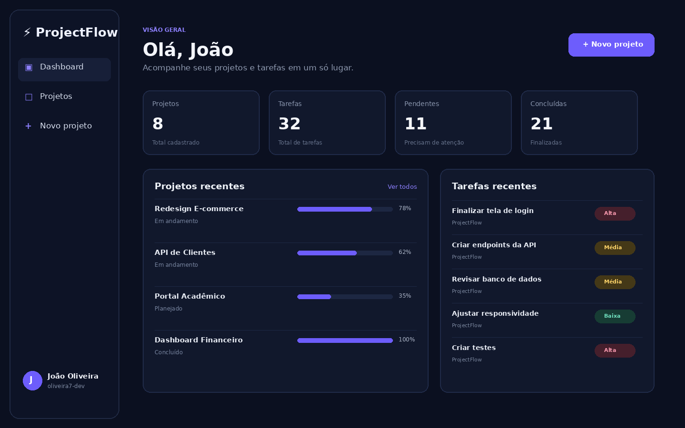

# ⚡ ProjectFlow

Sistema web de gerenciamento de projetos e tarefas, desenvolvido para demonstrar uma aplicação completa com autenticação, banco de dados, CRUD e dashboard.



## ✨ Funcionalidades

- Cadastro e login de usuários
- Dashboard com indicadores
- CRUD completo de projetos
- CRUD completo de tarefas
- Prioridade, status e prazo
- Filtro de projetos por status
- Cálculo automático de progresso
- Banco de dados relacional
- Layout responsivo

## 🛠️ Tecnologias

- Python
- Flask
- SQLAlchemy
- Flask-Login
- SQLite
- HTML5
- CSS3

## ▶️ Como executar

```bash
python -m venv .venv
.venv\Scripts\activate
pip install -r requirements.txt
python run.py
```

Depois acesse `http://127.0.0.1:5000`.

## 🗄️ Banco de dados

O projeto usa SQLite por padrão, mas pode ser migrado para PostgreSQL alterando a variável `SQLALCHEMY_DATABASE_URI`.

## 📂 Estrutura

```text
projectflow/
├── app/
│   ├── templates/
│   ├── static/
│   ├── __init__.py
│   ├── auth.py
│   ├── main.py
│   └── models.py
├── requirements.txt
├── run.py
└── README.md
```

## 👨‍💻 Autor

João Oliveira — Oliveira7-Dev

## 🌐 Deploy no Render

O projeto já inclui um `render.yaml` para publicar a aplicação e criar um banco PostgreSQL.

1. Envie este projeto para um repositório GitHub chamado `projectflow`.
2. Entre no Render.
3. Crie um novo **Blueprint**.
4. Conecte o repositório `Oliveira7-Dev/projectflow`.
5. O Render lerá o arquivo `render.yaml`.
6. Confirme a criação do Web Service e do PostgreSQL.
7. Após o deploy, abra a URL pública fornecida pelo Render.

Em produção, o sistema usa `DATABASE_URL`. Localmente, continua usando SQLite.


## 📱 Versão mobile e PWA

- Layout responsivo para smartphones
- Menu lateral com botão hambúrguer
- Navegação inferior para uso com uma mão
- Cards e tarefas adaptados para toque
- Suporte a instalação como PWA
- Ícone próprio na tela inicial
- Manifest e Service Worker incluídos

No Android/Chrome, abra o site publicado e use a opção **Adicionar à tela inicial** ou **Instalar app**.


## 🔐 Recuperação de senha por e-mail

O ProjectFlow possui fluxo de recuperação de senha com link temporário enviado por e-mail.

Variáveis necessárias no ambiente de produção:

```text
SMTP_HOST
SMTP_PORT
SMTP_USER
SMTP_PASSWORD
SMTP_FROM
SMTP_USE_TLS
```

O link de redefinição expira em 30 minutos.


## 🔑 Política de senha

A senha exige:

- mínimo de 10 caracteres
- pelo menos 1 letra maiúscula
- pelo menos 1 letra minúscula
- pelo menos 1 número
- pelo menos 1 caractere especial

As telas de cadastro e recuperação exibem uma barra de força da senha em tempo real.


## ⚙️ Configurações de perfil

O usuário autenticado pode:

- alterar nome e e-mail;
- acessar uma área exclusiva de segurança;
- alterar a senha somente após confirmar a senha atual;
- visualizar a força da nova senha em tempo real;
- usar a mesma política de senha forte aplicada no cadastro e recuperação.

A área de configurações é responsiva para desktop e dispositivos móveis.


## ✉️ Verificação obrigatória de e-mail

Novas contas ficam bloqueadas até que o usuário confirme o endereço por um link enviado ao e-mail informado.

- link válido por 24 horas;
- login bloqueado antes da confirmação;
- opção de reenviar o link;
- limitação de reenvios para reduzir abuso;
- usuários já existentes continuam ativos após a atualização.


## ✉️ E-mails HTML profissionais

Os e-mails transacionais do ProjectFlow possuem versão HTML responsiva e versão em texto simples como fallback.

Incluídos:

- confirmação de cadastro;
- recuperação de senha;
- identidade visual do ProjectFlow;
- botão de ação destacado;
- aviso de expiração;
- link alternativo para copiar e colar;
- remetente configurável com `SMTP_FROM_NAME`.
